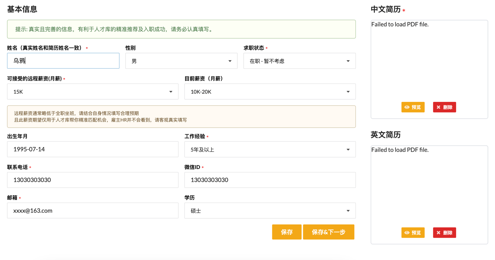
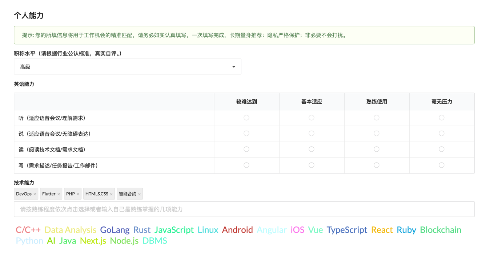
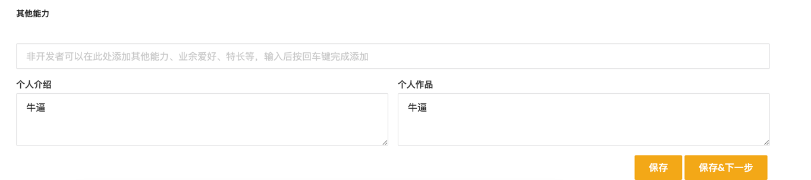
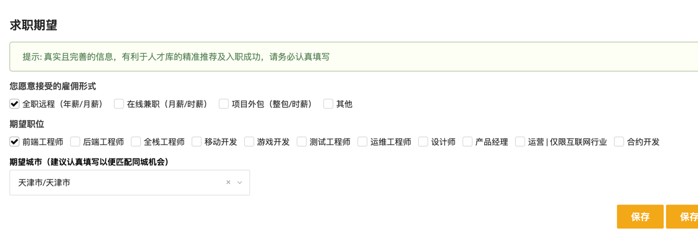
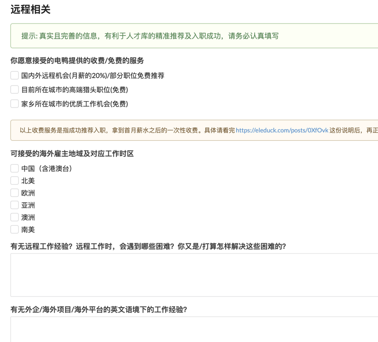

# talent社区介绍

talent社区, 是为了整合C端用户在平台上的职场社交, 不同普通社交的是, talent以更小的颗粒化去整合职场社交的内容, 达到精细化的社交目的, 以成为最大的`职场`社交社区

talent取意为天赋, 职场社交展现天赋, 人无与伦比的创造力, 然而根据天赋的核心理念, 衍生出主打的商业模式: 远程工作板块

所以, talent是专注于远程工作以及职场社交的平台, 致力于职场趣事/新闻/吐槽/讨论等社交场景, 创作者也可以在上面展现自我价值, 发挥自己的idea, 招揽自己的合作伙伴
对于talent市面上已经有相似度极高且运营的相当成熟的产品

**脉脉**, 这是一个职场的社交app, talent要做的是与该产品打差异化的运营模式, 主打无压力冲浪, 远程办公, 自由猎头, 庞大人才库, 线下聚会, 群鸦club等现代化职场社交场景这也是我们的核心竞争力, 应对脉脉这样的洪水猛兽, 我相信单一职责一定比大厂冗余业务缠身的平台做的更具代表性

> 原先想的是整合所有社交场景的内容, 但是想了下如何整合的这些内容, 所有的社交场景加起来是个非常复杂的场景, 如果都整合的化那将做不到事无巨细, 例如金融社交场景我是否要对接饿金融部分的资源作为宇宙的基础, 生活分享类的我是否又要建立不同的细分类型比如旅游/购物/美食/种草, 细分出来只会百无一成, 这不是我想看到的结果, 而职场社交就很好的解决这一问题, 专注与做某一领域的社交能够让平台有核心竞争力, 比如小红书专注与做生活分享社交(衍生业务也趋向于电商/推广/吸粉/广告), 这才是专注!!!

# talent的主要业务规划

## C端业务规划
C端板块层级
[Talent社区[C端]详细设计.md](talentClientDesignDoc%2FTalent%E7%A4%BE%E5%8C%BA%5BC%E7%AB%AF%5D%E8%AF%A6%E7%BB%86%E8%AE%BE%E8%AE%A1.md)

### ToC
#### 业务模型: 
以职场去开辟不同职场的群组(某岗位/职能/娱乐/地区/新闻), 满足人们的职场社交, 网上冲浪需求等社交闭环

| 业务板块          | 描述                                 | 是否盈利性质 | 盈利模型    |
|:--------------|:-----------------------------------|:-------|:--------|
| 用户通用社交        | 在平台发帖, 吐槽/技术分享/工具分享/寻人启事等优质内容      | 是      | 平台虚拟货币1 |
| 自由职业          | 以用户社区发帖, 为自己的(开源/个人/临时/自由hr)项目招兵买马 | 是      | 平台虚拟货币2 |
| 购买流量以及关注(low) | 用户购买流量提高帖子曝光率为目的                   | 是      | 平台虚拟货币3 |
| 群鸦club        | 平台官方俱乐部, 优质创作者与优秀自由职业从业者的名片        | 否      | 无       |

### ToB
#### 业务模型
以用户属性与平台优势, 开辟企业入驻, 发布委托, 专人跟进, 官方筛选/联系/对接天赋者, 达成招募闭环
服务化业务, 全套远程天赋者招募解决方案

**自由职业定义(费用初订)**

> 考虑做客户自行选择对接天赋者, 暂未有完善的企业与天赋者的隔离方案, so: low
> - 解决方法: 引入私域(企业微信作为交互媒介)

| 业务板块        | 描述            | 是否盈利性质 | 盈利模型   |
|:------------|:--------------|:-------|:-------|
| 企业委托(自由天赋者) | 适用于招募单个自由职业者  | 是      | 委托金1   |
| 企业委托(全职天赋者) | 在平台注册账号, 发布委托 | 是      | 委托金2   |
| 企业委托(团队委托)  | 在平台注册账号, 发布委托 | 是      | 委托金3,4 |

### 盈利模式解释

- 平台虚拟货币
  1. 赞赏: 充值平台虚拟货币以赞赏平台优质内容, 该货币可充值, 可提现
  2. 获取联系方式: 用户社区发帖招兵买马, 有偿解决问题, 获取发布者填写的联系方式
  3. 购买官方服务: 提高曝光率, 区块内/平台内顶置帖子, 官方渠道的远程工作/自由职业机会的推荐, 进入某高质量行业领域群聊

- 委托金 
  1. 自由天赋者: 项目合同/临时合约制, 收取该天赋者的录用月薪**30%~50%**
  2. 全职天赋者: 全职合同制, 收取该天赋者录用年薪的10%~20% 
  3. 天赋团队项目制: 收取团队项目合同的总包薪资20%
  4. 天赋团队项目制: 收取团队总年薪的15%~30%

# talent与其他平台的差异化

1. 与其他平台不同, talent社区的颗粒度更细, 天赋者能在更细分化的领域里找到价值与提供价值
2. talent实行穿作者激励奖励, 激励人们创作与知识付费, B站自媒体的理念
3. 比其他平台更完善的功能, 制度, 优质的目标用户
4. 职场社交+灵活就业的属性, 相辅相成
5. 天赋者自荐上墙: 展示天赋者的平台, 展示你的能力, 作品等优势
6. 群鸦club, 提高平台优质作者凝聚力与精英私域社群
7. 身份铭牌与红利: 比如我们上学会看到贵族学校的校服和公立学校的校服是不一样的, 个性化的优越感能增强平台的认可度, 红利包括但不限于:
    1. 线下聚会
    2. 资源共享
    3. 线下娱乐场所对群鸦俱乐部成员优惠
    4. 参与虚拟宇宙建设(虚拟宇宙是我想的一个新理念: 专注于做互联网+的产品与平台, 旨在足不出户做我想做的所有事)

# talent核心竞争力总结
1. 拥有完善职场社交属性的自由职业细分领域, 友好职场平台, 兼容性高, 专注性强, 吃定未来工作模式
2. 以社交为主的自由职业招聘网站
3. 未来灵活用功与时间利用方向
4. 高端人才库, 涵盖职场各种行业从业人员, 增强品牌力
5. toC and toB 双向收费, 盈利模式闭环
6. 企业积累, 灵活就业增长=平台收益增长
7. 精英人才群鸦俱乐部, 更细化的职场精英社交领域
8. 私域化运营, 用户粘性高, 归属感强, 可扩展性高
9. 未来的扩展: AI, 职场工具, 电商, club定制周边, 线上团队协作, 线上会议, 云服务, 总之办理一些能线上协作/办理/交流等业务, 我愿称之为: 虚拟宇宙

# 关于如何确保天赋者与公司自身的权益

> 公司方与天赋者的雇佣关系, 由平台作为媒介, 公司方和天赋者分别向talent签署合作协议, talent主管对接对双方的权益, 如果一方毁约, 另一方权益不会受到损失, talent平台会向毁约方追责

# talent市场推广方式

1. 平台SEO优化, 提高域名等级/收录等数据
2. 短视频平台发布视频推广
3. 其他社交平台(知乎/脉脉/小红书)发帖, 增加曝光

# talent用户运营方式

粘性: 对接企业微信, 私域管理, 作为天赋者的线下交流以及维护粘性

机会委托: 用户发布委托, talent官方筛选合适候选人, 再与委托发起人对接, 分情况选择对接方式
    - 项目委托1: 候选人交付委托发起人, 由他们面试筛选及其薪资谈判
    - 项目委托2: talent平台全程跟进, 委托发起人只需进行面试筛选, 薪资谈判及合同签订等都由talent负责

社区违规维护: talent平台全程跟进根据事情严重性进行禁言或者封禁处罚

# C端业务规划-解释
1. 加入人才库-基本信息

2. 加入人才库-个人能力

3. 加入人才库-期望

4. 加入人才库-远程相关

# 公司主体
- 虚拟宇宙
- 群鸦俱乐部
- 群鸦集团

## 群鸦俱乐部理念

- 群鸦俱乐部旨团结天赋者, 享受生活与世界美好, 娱乐/交流/互助/资源共享性质, 是某行业某职能的佼佼者, 是线下活动的发起者

TODO: 天赋者定义: 每个人都蕴含着天赋, 并不指从事某某职业=他就是某某天赋

# AI Q&A
## boss直聘当时为何能杀出重围, 超越了同赛道的竞争者, 它的核心竞争力是什么

BOSS直聘之所以能在激烈的招聘市场竞争中脱颖而出，主要归功于以下几个核心竞争力：

1. **创新的模式**：
   BOSS直聘引入了“直聊”模式，即求职者可以直接与雇主进行即时通讯，打破了传统招聘网站的信息壁垒，使得招聘流程更加高效、直接。这种模式缩短了招聘周期，降低了招聘成本，同时也增加了求职者和雇主之间的互动。

2. **个性化匹配算法**：
   利用先进的AI技术和大数据分析，BOSS直聘能够为求职者提供更精准的职位推荐，同时也能帮助雇主更准确地筛选候选人，提高匹配成功率。

3. **用户体验优化**：
   BOSS直聘注重用户体验，界面简洁直观，操作流畅，使得用户能够轻松使用。良好的用户体验有助于吸引和保留用户，形成口碑效应。

4. **技术驱动**：
   BOSS直聘持续在技术研发上进行大量投入，拥有一支庞大的研发团队，这保证了其产品和服务能够不断创新和升级，保持技术领先。

5. **市场定位和策略**：
   BOSS直聘最初聚焦于中小企业和年轻求职者市场，这部分市场由于灵活性高，对新技术接受度好，成为了BOSS直聘初期快速增长的重要动力。

6. **资本支持**：
   在发展过程中，BOSS直聘获得了多轮融资，这些资金支持了公司的扩张和技术创新，帮助它在市场中稳固地位。

7. **品牌营销**：
   通过有效的市场营销和广告策略，BOSS直聘提升了品牌知名度，尤其是在年轻人中的影响力，这也有助于吸引更多的求职者和企业客户。

综上所述，BOSS直聘凭借其创新的业务模式、强大的技术实力以及优秀的用户体验设计，在招聘行业中形成了独特的竞争优势，成功吸引了大量的用户，并最终在竞争中占据了有利位置。

1. [为什么BOSS直聘会赢得市场?](https://www.zhihu.com/question/421561112/answer/1524266285)
2. [boss怎么做流量大，不止是流量：Boss直聘为什么会异军突起？](https://www.woshiqian.com/post/68891.html)
3. [深度解读BOSS直聘的商业模式，为何市值超过一众招聘网站？](https://xw.qianzhan.com/analyst/detail/329/210613-543829dc.html)
4. [BOSS直聘拟赴美IPO，内卷化赛道上如何超车？](https://new.qq.com/rain/a/20210527A0CWR900)
5. [1倍研发、2倍营销，BOSS直聘如何突破“营销局”？](https://www.yemacaijing.com/index/view/id/68721)
6. [BOSS直聘(BZ.O):领跑千亿互联网招聘赛道，高业务增速助推商业潜力释放-新浪财经](https://cj.sina.com.cn/articles/view/5115326071/130e5ae7702001dmo4)
7. [深度解读BOSS直聘的商业模式，为何市值超过一众招聘网站？-网易](https://m.163.com/dy/article/GCDHB8CU05118KL0.html)
8. [从巨亏10亿到年赚11亿，4900万求职者拯救了BOSS直聘？](https://m.thepaper.cn/newsDetail_forward_26744716)
9. [血海竞争的招聘行业，BOSS直聘为何能做到上市?](http://tech.ikanchai.com/article/20210618/426706.shtml)