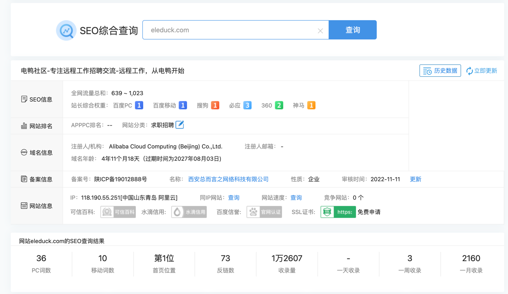
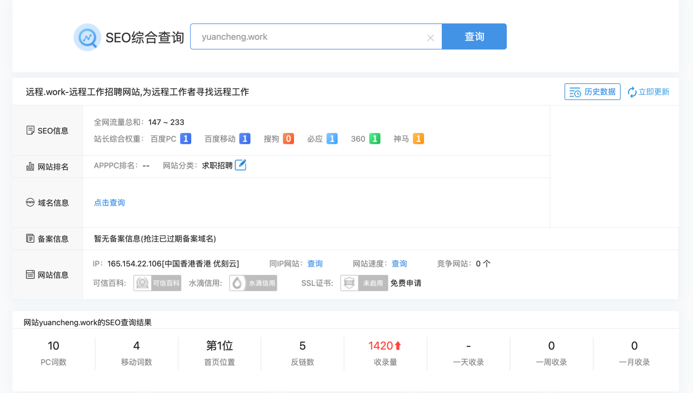
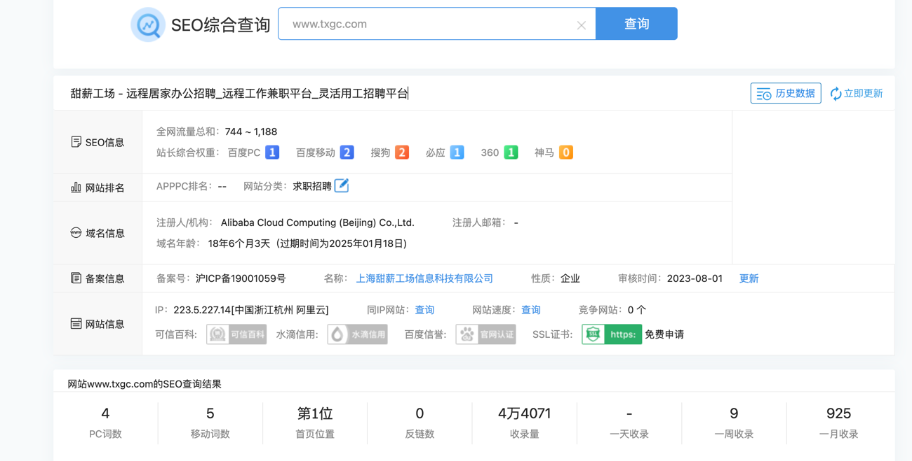

# 同类平台调研

| 平台名称         | 官方网站                                     | 用户体量估算 | 是否有APP | 日均博客数量 | 群组(分类)  | 社区(用户社交)   |所属企业     | 地址 | 微信公众号 |
|:-------------|:-----------------------------------------|:-------|:-------|:-------|:--------|:-----------|:--------|:---|:------|
| 电鸭           | [eleduck.com](https://eleduck.com)       | ±15w | 有      | ±30    | 有(分类明确) | 有          | 西安总而言之网络科技有限公司  | 西安 | 有     |
| 远程工作         | [yuancheng.work](https://yuancheng.work) | ±9w    | 无      | 无社交属性  | 无       | 无(纯远程工作招聘) |深圳风启禾泰科技有限公司 | 深圳 |有|
| 甜薪工厂         | [www.txgc.com](https://www.txgc.com)     | ±36w   | 无      | 有但形同虚设 | 无 | 无(纯远程工作招聘) | 上海甜薪工场信息科技有限公司 | 山海 | 有 |
| LinkedIn(领英) |                                          |        |        |        |   |            |                |    |   |
|        一览      | [www.yl1001.com](https://www.yl1001.com/)            |        |        |        |   |            |                |    |   |

## 站点数据调研
### 电鸭SEO

- 有用户社交属性, 群组划分清晰
- 月活用户不多, 日帖±30
- 招聘模式部分为用户自行发帖招聘, 官方对接招聘两种方式
- 有用户虚拟货币充值, 打赏规则清晰

### 远程工作SEO

- 纯招聘平台, 官方对接招聘模式
- 域名备案已过期

### 甜薪工厂SEO

- 平台很大, 用户基数36万左右
- 有博客模块但是形同虚设
- 收录量很多
- 近三五年的产品, 但是用户基数大, 岗位多