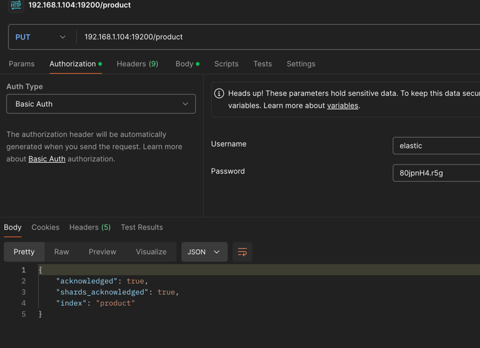
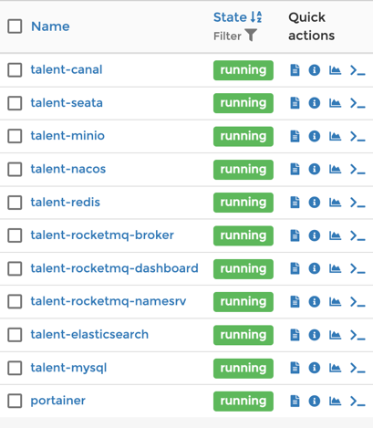

<!-- TOC -->
* [系统限制](#系统限制)
* [mysql](#mysql)
  * [命令](#命令)
* [nacos](#nacos)
  * [命令](#命令-1)
* [docker](#docker)
  * [命令](#命令-2)
  * [docker安装的镜像以及容器/镜像操作(实时更新)](#docker安装的镜像以及容器镜像操作实时更新)
    * [portainer](#portainer)
    * [talent-redis](#talent-redis)
    * [talent-mysql](#talent-mysql)
    * [talent-nacos](#talent-nacos)
    * [talent-minio](#talent-minio)
    * [talent-elasticsearch](#talent-elasticsearch)
    * [talent-seata](#talent-seata)
    * [talent-canal](#talent-canal)
    * [rocketMQ](#rocketmq)
* [致此全部组件安装完毕](#致此全部组件安装完毕)
<!-- TOC -->


# 系统限制
- 无论是什么方式创建的文件夹以及文件, 都可能出现无权限的问题, 可以先用`sudo chmod 777 xx`去设置权限

# mysql
```text
mysql安装在/mnt/mysql目录下
版本: 5.7.36
端口: 3306
账密: root/QLL@766pikaqiu
```

## 命令
```shell
# 启动
cd /mnt/mysql-5.7.36/support-files
./mysql.server start
```

# nacos
```text
nacos安装在/mnt/nacos目录下
版本: 2.x
端口: 18848
url: http://192.168.1.104:18848/nacos
账密: nacos/nacos
```

## 命令
```shell
# 启动
cd /mnt/nacos/bin
./startup.sh -m standalone
```

# docker
```text
docker安装在/var/lib/docker目录下(不确定, 用的脚本安装的)
```


## 命令
```shell
# 重新加载systemd的配置
sudo systemctl daemon-reload
# daemon守护进程配置: 现在只配置了镜像安装位置
sudo vim /etc/docker/daemon.json
# 启动关闭重启
sudo systemctl start docker
sudo systemctl stop docker
sudo systemctl restart docker
```
## docker安装的镜像以及容器/镜像操作(实时更新)

### _portainer_
简介: portainer是一个界面化操作docker的工具, 安装启动后会有客户端访问

```text
url: http://192.168.1.104:9000/#/images
账密: admin/QLL594766
```

### talent-redis
```text
host: 192.168.1.104
容器端口: 6379
映射端口: 16379
password: 80jpnH4.r5g
```

### talent-mysql
```text
host: 192.168.1.104
容器端口: 3306
映射端口: 13306
password: QLL@766pikaqiu
```

### talent-nacos

```text
host: http://192.168.1.104:18848/nacos
容器端口: 8848
映射端口: 18848
账密: nacos/nacos
```

### talent-minio
```text
host:
    管理后台: 192.168.1.104:19090
    api: 192.168.1.104:19000
容器端口: 19090, 19000
映射端口: 19090, 19000
账密: admin/admin123456
bucket: talent-dev
```

### talent-elasticsearch
```text
host: 192.168.1.104:19200
容器端口: 19200, 19300
映射端口: 19200, 19300
账密: elastic/80jpnH4.r5g
```

postman加入索引(例):



body json看[product.md](..%2Fes%2Fproduct.md)

### talent-seata
```text
host: http://192.168.1.104:17091/#/TransactionInfo
容器端口: 18091, 17091
映射端口: 18091, 17091
账密: seata/seata
```

### talent-canal
```text
host: 192.168.1.104:11111
容器端口: 18091, 17091
映射端口: 18091, 17091
连接mysql账密: canal/canal
```

### rocketMQ
```text
service: talent-rocketmq-broker, talent-rocketmq-dashboard, talent-rocketmq-namesrv
host: 192.168.1.104:8180
容器端口: 9876, 10909, 10911
映射端口: 9876, 10909, 10911
连接mysql账密: canal/canal
```

### gen 代码生成工具
// todo 暂未同步到docker-compose脚本
```text
service: talent-gen
host: 192.168.1.104:16969
容器端口: 6969
映射端口: 16969
```
```shell
# pull image
docker pull registry.cn-hangzhou.aliyuncs.com/tanghc/gen:latest
# 启动
docker run --name talent-gen --restart=always \
  -p 16969:6969 \
  -v /mnt/talent-docker-compse/gen/:/opt/gen/ \
  -v /mnt/talent-docker-compse/gen/conf/:/gen/conf/ \
  -v /mnt/talent-docker-compse/gen/ext:/gen/ext \
  -d registry.cn-hangzhou.aliyuncs.com/tanghc/gen:latest
```

## docker fro 阿里云仓库
阿里云仓库传送门: [talent-docker-model-bak](https://cr.console.aliyun.com/repository/cn-guangzhou/talent-docker-model-bak/my-deepin-docker-image-bak/images)
```shell
# images list 服务对照 阿里云仓库的镜像
REPOSITORY                                                           TAG                            IMAGE ID                 SIZE
registry.cn-hangzhou.aliyuncs.com/tanghc/gen                         latest                         08f98c1315e9             106MB
registry.cn-hongkong.aliyuncs.com/mall4j-images/redis                7.0                            280bc8b91f63             109MB
registry.cn-hongkong.aliyuncs.com/mall4j-images/elasticsearch        7.17.21                        1cec81adb506             638MB
registry.cn-hongkong.aliyuncs.com/mall4j-images/minio                RELEASE.2024-04-18T19-09-19Z   24c470c8cdb1             158MB
registry.cn-hongkong.aliyuncs.com/mall4j-images/rocketmq             5.2.0                          07de70081c45             755MB
registry.cn-hongkong.aliyuncs.com/mall4j-images/mysql                8.0.35                         77f16659c129             591MB
registry.cn-hongkong.aliyuncs.com/mall4j-images/seata-server         2.0.0                          b5a0ca751582             695MB
registry.cn-hongkong.aliyuncs.com/mall4j-images/canal-server         v1.1.7                         09174473b695             1.67GB
registry.cn-hongkong.aliyuncs.com/mall4j-images/rocketmq-dashboard   1.0.1                          474119e83d17             621MB
nacos/nacos-server                                                   latest                         bdf60dc2ada3             1.05GB
portainer/portainer                                                  latest                         580c0e4e98b0             79.1MB

# 阿里云仓库push命令

# login aliyun
sudo docker login --username=pikaqiu_qll registry.cn-guangzhou.aliyuncs.com

# push
sudo docker tag 580c0e4e98b0 registry.cn-guangzhou.aliyuncs.com/talent-docker-model-bak/my-deepin-docker-image-bak:latest
sudo docker push registry.cn-guangzhou.aliyuncs.com/talent-docker-model-bak/my-deepin-docker-image-bak:latest

# pull
sudo docker pull registry.cn-guangzhou.aliyuncs.com/talent-docker-model-bak/my-deepin-docker-image-bak:[镜像版本号]
```


# 致此全部组件安装完毕


# 宿主机已经占用端口记录

| module               | position | ports               |
|:---------------------|:---------|:--------------------|
| rocketMQ             | docker   | 9876, 10909, 10911  |
| talent-canal         | docker   | 18091, 17091        |
| talent-seata         | docker   | 18091, 17091        |
| talent-elasticsearch | docker   | 19200, 19300        |
| talent-minio         | docker   | 19090, 19000        |
| talent-nacos         | docker   | 18848, 19848, 19849 |
| talent-mysql         | docker   | 13306               |
| talent-redis         | docker   | 16379               |
| portainer            | docker   | 9000                |
| talent-gen           | docker   | 16969               |
| mysql                | local    | 3306(已停止运行)         |
| nacos                | local    | 8848(已停止运行)         |
